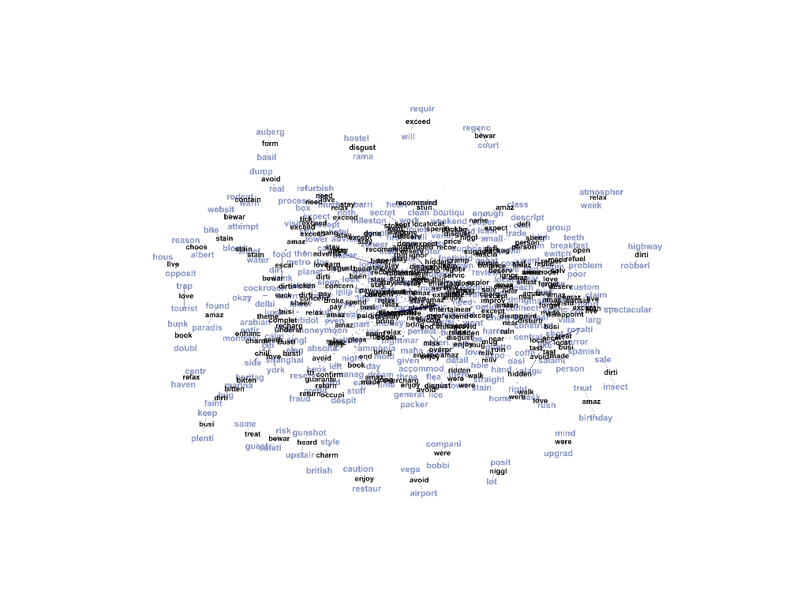
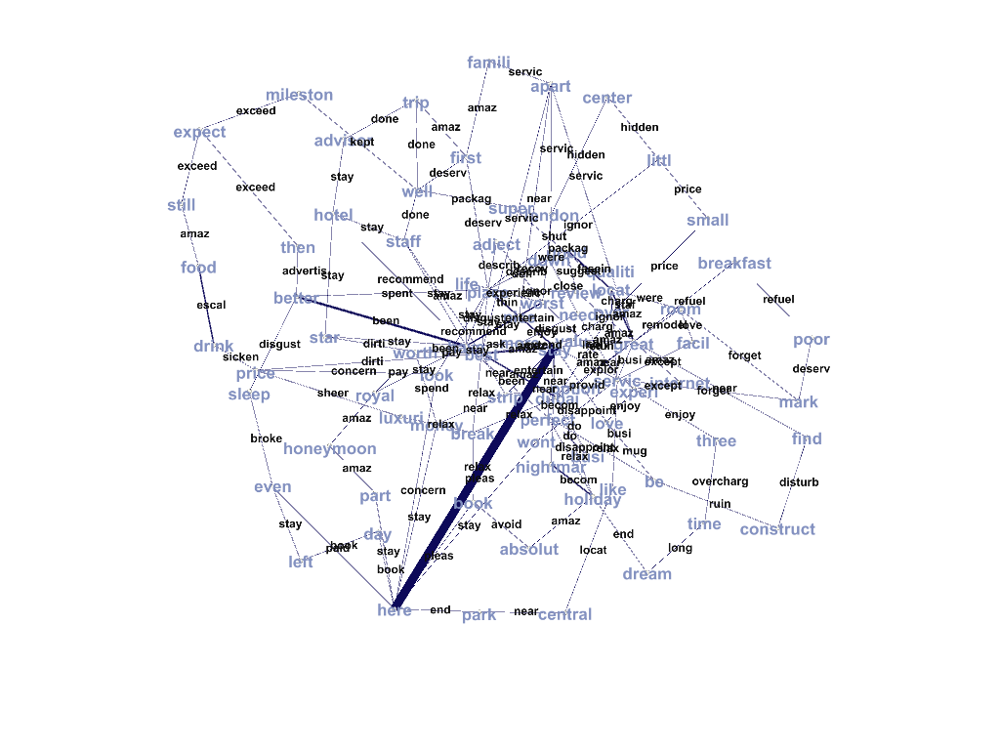
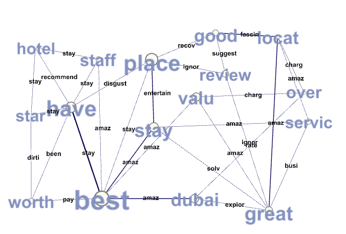

# Knowledge acquestion from Hotel reviews

Date: **28.05. (Due: 27.05.)**

Name: **Balaji Subramani**

Session: **[Knowledge Graph](https://textvis.repke.eu/index.html)**

Code: on **[GitHub](https://github.com/balag752/Text-Visualization-Blog-6-Knowledge-Graph)**

## Objective

This blog is focused to visualize the Knowledge Graph features. Here also, we experimented knowledge graph functionality with Trip adviser dataset.

## Data Filter

Due to the huge size of the volume, we have restricted and filtered low rated (<2) & high rated (4.8) reviews, for knowledge graph. Even from available data, we have only extracted review title instead of review content. So that we are able to gain the main intution of review with minimal data.

## Knowledge Graph Data Set

We have splitted topics to cleansed tokens. Then created combination of words with triphlets. After that, finding the nouns and verb for each word in triphlets. Finally forming the triphlets which is having 2 nouns and one verb. Finally, stemmed the noun and verb. Unfortunately, stemming is not did a good work. So some words are converted properly. But sill understandable.

#### Node :

From the overall reviews topics, we are extracting all the nouns for nodes. Nodes data set is having below attributes

- ID - word

- Label - word

#### Edges :

Edges are designed based on triphlets. Edge source & target nodes are select from noun and edges are considering here as a verb.

- Source - Noun 

- Target -  Noun

- Edge - Verb

All edges are considered as a indirect edge in our analysis.

# Knowledge Graph

We have used gephi tool for knowledge graph visualization. Node and Edge data sets are given as the input for text visulization.

 

Above image is shows the whole knowledge set in graph. Here Blue nodes are acting the as a Domain and edge is acting as the relationship between 2 nodes.

There are lot of inter connection of nodes in center of the graph. So we wiill apply kcore filter to view it in better way.

 

Still center part is convoluted. But we will see in different graph. now focus on the outside of the graph. Here Top left, we could see lot of relationship with **exceed** word. Also **amaze** word is connected with *Family*, *First* as well as *still* and *food*.

Now move into the inner core of the graph (k=3). Here we applied Between centrality with node size.  Here the **Best** word is acting as major node. It also have strong relationship with *amaze*.

Also, funny part here is place and reivew is realted with ignore. Also, **great** is related with **busy**.

### Conclusion

 In our above analysis, we could not get much inference as we dont have proper relationship words. Stil we find the major connection with available relationship word.
